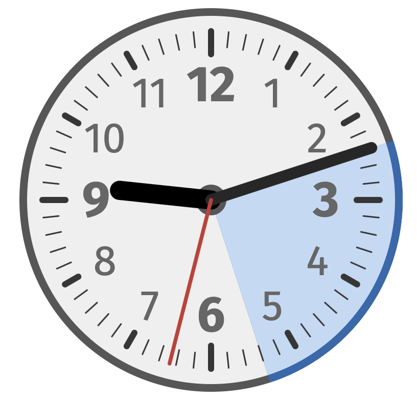

AnalogClock
===========

**Analog Clock for OBS Studio or vMix**

Abstract
--------

**AnalogClock** is a plain HTML/CSS/JS Browser Source layer for [OBS
Studio](http://obsproject.com/) or [vMix](https://www.vmix.com/) for
displaying a classical analog clock based timer. This is usually used as
a count-down until an event starts or as a duration for a pause.



Installation
------------

1. Install [Node.js](https://nodejs.org/) and [Git](https://git-scm.com/).

2. Clone the **AnalogClock** sources:<br/>
   `git clone --depth 1 https://github.com/rse/analogclock`<br/>
   `cd analogclock`<br/>

3. Download all dependencies:<br/>
   `$ npm install`

Usage
-----

4. Add your *Browser Source* source to *OBS Studio*:

   - Local File: **(disabled)**
   - URL: *local-path*`/analogclock/index.html?`*options*
   - Width: **1920** (or whatever is your stream resolution width)
   - Height: **1080** (or whatever is your stream resolution height)
   - Use custom frame rate: **(disabled)**
   - Control audio via OBS: **(disabled)**
   - Custom CSS: **(empty)**
   - Shutdown source when not visible: **(enabled)**
   - Refresh browser when scene becomes active: **(enabled)**

   Or add your *Web Browser* input to *vMix*:

   - URL: `file://`*local-path*`/analogclock/index.html?`*options*
   - Width: **1920** (or whatever is your stream resolution width)
   - Height: **1080** (or whatever is your stream resolution height)

Options
-------

### Time Options

- **until**=*iso-time* (duration for segment display until time in ISO format `YYYY-MM-DDTHH:MM:SS`, default: none)
- **duration**=*minutes* (duration for segment display in 1-60 minutes, default: none)
- **fraction**=*minutes* (fraction in minutes to round up duration, default: none)
- **autostop** (whether to automatically stop clock when timer ended, default: none)

Hint: if either option `duration` or `until` are given, the clock with
show a done/todo-segment and automatically shuts down once the ending
time is reached.

### Size Options

- **width**=*pixels* (width of clock in pixels, default: `500`)
- **height**=*pixels* (height of clock in pixels, default: `500`)
- **opacity**=*number* (amount of opacity of clock in 0.0-1.0 range, default: `1.0`)

### Color Options

- **background1**=*color* (outer border color, default: `#555555`)
- **background2**=*color* (inner background color, default: `#f0f0f0`)
- **background3**=*color* (soft attention overlay color, default: `#ffcc66`)
- **background4**=*color* (hard attention overlay color, default: `#ff6666`)
- **ticks**=*color* (color of ticks, default: `#333333`)
- **digits**=*color* (color of digits, default: `#666666`)
- **pointer1**=*color* (color of hour pointer, default: `#000000`)
- **pointer2**=*color* (color of minute pointer, default: `#222222`)
- **pointer3**=*color* (color of second pointer, default: `#cc0000`)
- **segment1**=*color* (outer color of done segment display, default: `#b06820`)
- **segment2**=*color* (inner color of done segment display, default: `#f4dbc2`)
- **segment3**=*color* (outer color of todo segment display, default: `#2068b0`)
- **segment4**=*color* (inner color of todo segment display, default: `#c2dbf4`)

Control
-------

For interactively controlling **AnalogClock** press:

- duration-based timer of (*N* x 10) + *M* minutes:<br/>
  <kbd>d</kbd> <kbd>*N*</kbd> <kbd>*M*</kbd> (*N* = `0` ... `5`, *M* = `0` ... `9`)
- until-based timer to (*N* x 10) + *M* minute:<br/>
  <kbd>u</kbd> <kbd>*N*</kbd> <kbd>*M*</kbd> (*N* = `0` ... `5`, *M* = `0` ... `9`)
- manual attention via clock flashing:<br/>
  <kbd>a</kbd> <kbd>*N*</kbd> <kbd>s</kbd> (*N* = `1` ... `9`, soft/orange) or<br/>
  <kbd>a</kbd> <kbd>*N*</kbd> <kbd>h</kbd> (*N* = `1` ... `9`, hard/red)
- termination of timer:<br/>
  <kbd>x</kbd>

HUDS
----

Alternatively, instead of running **AnalogClock** as a standalone
application, it can also be run on top of [Head-Up-Display Server
(HUDS)](https://github.com/rse/huds). The advantage is that instead
of having to interactively control **AnalogClock**, it can be remote
controlled through HTTP and MQTT.

For this, run HUDS with **AnalogClock** with:

```sh
npx huds -a 0.0.0.0 -p 9999 -d analogclock:index-huds.html,index-huds.yaml
```

And then use the following URL for rending **AnalogClock** in OBS Studio or vMix:

`https://localhost:9999/analogclock/`

Finally, use the following URLs with HTTP `GET` requests for remote
controlling **AnalogClock** from e.g. Stream Deck, Companion,
CentralControl or ShowCockpit:

- `https://localhost:9999/analogclock/event/duration.`*N* (*N* = `0`...`59`)
- `https://localhost:9999/analogclock/event/until.`*N* (*N* = `0`...`59`)
- `https://localhost:9999/analogclock/event/attention.`*N*`.`*type* (*N* = `1`...`9`, *type* = `soft` or `hard`)
- `https://localhost:9999/analogclock/event/terminate`


License
-------

Copyright (c) 2021-2022 Dr. Ralf S. Engelschall (http://engelschall.com/)

Permission is hereby granted, free of charge, to any person obtaining
a copy of this software and associated documentation files (the
"Software"), to deal in the Software without restriction, including
without limitation the rights to use, copy, modify, merge, publish,
distribute, sublicense, and/or sell copies of the Software, and to
permit persons to whom the Software is furnished to do so, subject to
the following conditions:

The above copyright notice and this permission notice shall be included
in all copies or substantial portions of the Software.

THE SOFTWARE IS PROVIDED "AS IS", WITHOUT WARRANTY OF ANY KIND,
EXPRESS OR IMPLIED, INCLUDING BUT NOT LIMITED TO THE WARRANTIES OF
MERCHANTABILITY, FITNESS FOR A PARTICULAR PURPOSE AND NONINFRINGEMENT.
IN NO EVENT SHALL THE AUTHORS OR COPYRIGHT HOLDERS BE LIABLE FOR ANY
CLAIM, DAMAGES OR OTHER LIABILITY, WHETHER IN AN ACTION OF CONTRACT,
TORT OR OTHERWISE, ARISING FROM, OUT OF OR IN CONNECTION WITH THE
SOFTWARE OR THE USE OR OTHER DEALINGS IN THE SOFTWARE.

